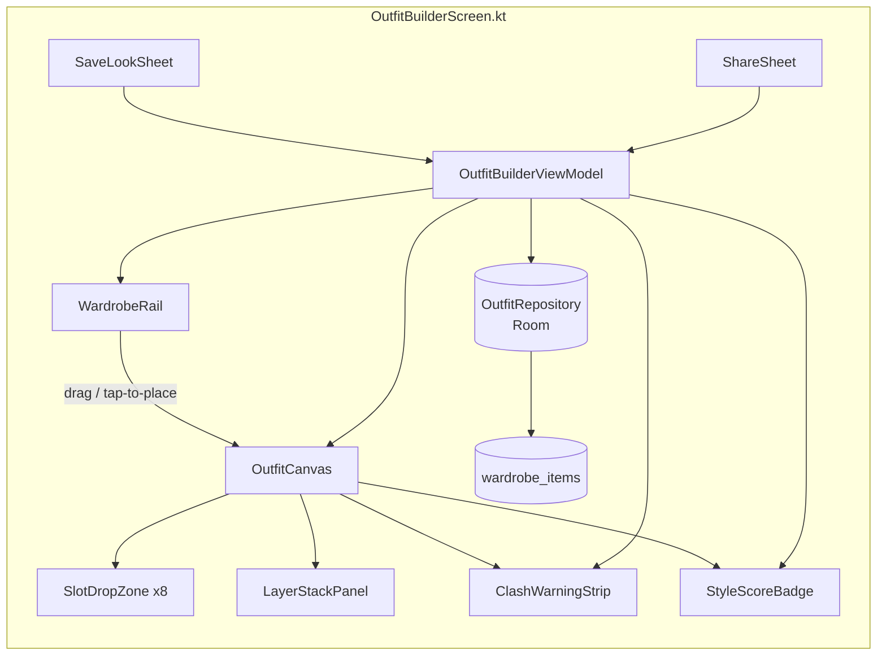
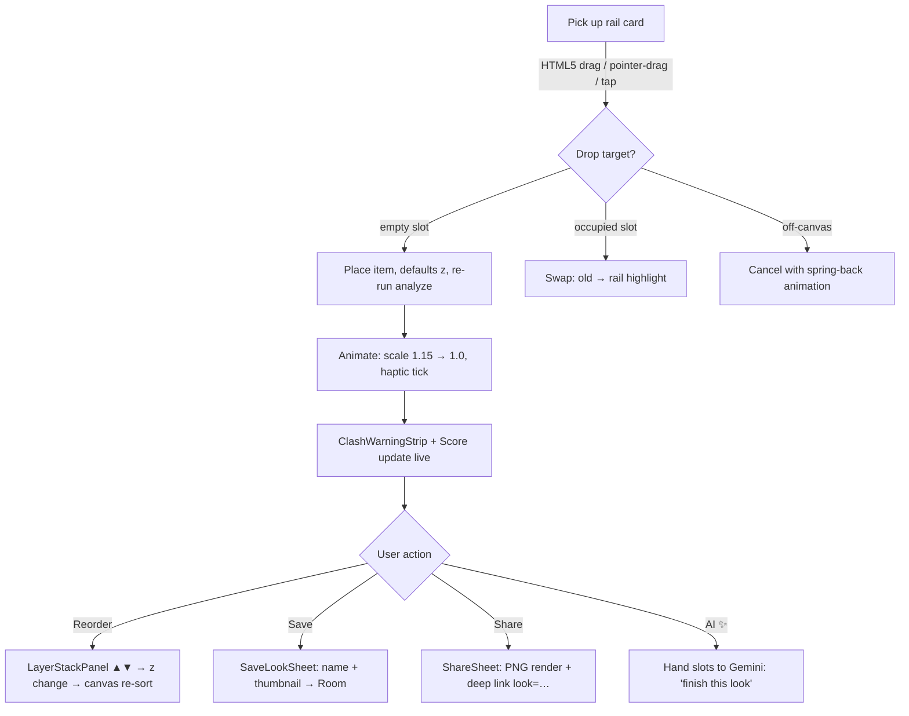

# OUTFIT_BUILDER.md — StyleDrop "Mix & Match" Outfit Canvas

> Design spec + interactive prototype for the StyleDrop Outfit Builder feature.
> Repo: https://github.com/ibrahimsidic12-afk/styledropv2 (Android / Jetpack Compose / Room / Material3)
> Prototype: `outfit_builder.html` (self-contained, zero dependencies — open in any browser)

---

## 1. Context & Where It Plugs Into StyleDrop

The current app already has the exact hook for this feature — `SavedOutfitsScreen.kt`
renders a "Mix & Match" icon (`Icons.Rounded.DashboardCustomize`) with a `/* TODO */`.
The Outfit Builder **is** that TODO. Everything below is modeled on what actually
exists in the codebase:

| Existing in repo | Used by Outfit Builder |
|---|---|
| `WardrobeItem` (`models/WardrobeItem.kt`) — `id, imageUrl, category, type, color, secondaryColor, style, fit, pattern, season, brand, isFavoriteItem` | Source of every draggable card; `color`/`pattern`/`style` drive clash detection & scoring |
| `ItemCategory` — Tops, Bottoms, Shoes, Outerwear, Accessories, Bags, Watches, Jewelry (+ `ItemCategory.emoji()`) | The 8 canvas slots and rail filter chips |
| `WardrobeDao` / `WardrobeRepository` (Room, Flow-based) | New DAO methods for outfit persistence (§6) |
| Theme (`ui/theme/Color.kt`) — ivory `#FAF7F0`, ink `#1B1A17`, gold `#B08A4F`, line `#E7E0D2` | Canvas chrome, warning/score accents (prototype mirrors these tokens) |

---

## 2. Wireframes

### 2.1 Main builder screen (phone-first, adapts to tablet landscape)

```
┌─────────────────────────────────────────────────────────┐
│  ✦ Outfit Builder            [🎲 Random] [🗑 Clear]  ✕  │  ← TopAppBar
├───────────────┬─────────────────────────────────────────┤
│               │            CANVAS  (16:11)              │
│  WARDROBE     │   ┌───────────────────────────────┐     │
│  RAIL         │   │        ⬡ hat slot             │     │
│               │   │  💍  ┌─────────┐              │     │
│ [All][Tops]   │   │      │ outer 🧥│  ⌚          │     │
│ [Bottoms]…    │   │      │  top 👕 │              │     │
│               │   │      └─────────┘              │     │
│ ┌───────────┐ │   │   ┌─────────┐  👜            │     │
│ │ 👕 Washed  │ │   │   │bottom 👖│               │     │
│ │ Denim Jack │ │   │   └─────────┘               │     │
│ │ Outerwear  │ │   │      👟 shoes               │     │
│ └───────────┘ │   └───────────────────────────────┘     │
│ ┌───────────┐ │   body silhouette guides placement       │
│ │ 👖 Black   │ │                                         │
│ │ Tapered…   │ ├─────────────────────────────────────────┤
│ └───────────┘ │  ⚠ 1 clash · Score ─────── 78 ── Solid   │
│   (scroll ↕)  │  [Layers ▾] [Save Look] [Share] [AI ✨]  │
└───────────────┴─────────────────────────────────────────┘
```

### 2.2 Inspector drawer (expanded state)

```
┌ Inspector ────────────────────────────────┐
│ LAYER STACK            (top = frontmost)  │
│   ☰ 🧢 Cap            ▲ ▼   z=40         │
│   ☰ 🧥 Denim Jacket    ▲ ▼   z=30         │
│   ☰ 👕 White Tee       ▲ ▼   z=20         │
│   ☰ 👖 Trousers        ▲ ▼   z=10         │
│ ─────────────────────────────────────────  │
│ COLOR CHECK                                │
│   ⚠ Rust Jacket + Olive Pants — hues 40°   │
│     apart, both muted → soft clash         │
│   ✓ Neutrals anchor the palette            │
│ ─────────────────────────────────────────  │
│ STYLE SCORE        78 / 100  ── Solid      │
│   Harmony    ████████░░  30/40             │
│   Complete   █████████░  27/30             │
│   Pattern    ███████████ 15/15             │
│   Cohesion   ███████░░░  6/15              │
└────────────────────────────────────────────┘
```

### 2.3 Component graph



---

## 3. Data Model (Room, mirrors existing conventions)

```kotlin
@Entity(
    tableName = "outfits",
    foreignKeys = [], // slots reference wardrobe_items loosely (survives item deletion)
    indices = [Index("createdAt")]
)
data class Outfit(
    @PrimaryKey val id: String = UUID.randomUUID().toString(),
    val name: String = "Untitled Look",
    val createdAt: Long = System.currentTimeMillis(),
    val lastScore: Int = 0,          // cached, recomputed on edit
    val coverColorHex: String = ""   // first item color, for saved-look thumbnails
)

@Entity(tableName = "outfit_slots", primaryKey = ["outfitId","slotId"])
data class OutfitSlot(
    val outfitId: String,
    val slotId: String,        // HAT, OUTER, TOP, BOTTOM, SHOES, WATCH, BAG, JEWELRY
    val itemId: String?,       // WardrobeItem.id, null = empty slot
    val zIndex: Int = 0        // layer ordering, higher = frontmost
)
```

DAO additions to `WardrobeDao.kt` (or a new `OutfitDao`): `getOutfitWithSlots`,
`upsertOutfit`, `deleteOutfit`, `getSavedOutfits(): Flow<List<Outfit>>`.

**ViewModel state** (`OutfitBuilderViewModel`):

```kotlin
data class BuilderUiState(
    val slots: Map<SlotId, PlacedItem?>,   // PlacedItem = WardrobeItem + zIndex
    val analysis: OutfitAnalysis,          // warnings + score, derived
    val savedLooks: List<Outfit> = emptyList(),
    val isDirty: Boolean = false
)
```

`analysis` is a pure function of `slots` (`analyze(slots): OutfitAnalysis`) —
same function used by the prototype, the unit tests, and the AI Stylist prompt.

---

## 4. Layer Model — Slots, Z-Index & Placement Rules

Two-layer system: **slot affinity** (where an item *can* go) × **z-index**
(what renders on top when regions overlap).

### 4.1 Slot table

| SlotId | Category affinity | Default z | Canvas region | Drop hint |
|---|---|---|---|---|
| `HAT` | Accessories | 40 | head | "Cap / beanie" |
| `JEWELRY` | Jewelry | 45 | neck (frontmost at chest) | "Chain / pendant" |
| `OUTER` | Outerwear | 30 | torso, drawn over top | "Jacket / coat" |
| `TOP` | Tops | 20 | torso base | "Tee / shirt / knit" |
| `WATCH` | Watches | 50 | wrist | "Watch / bracelet" |
| `BAG` | Bags | 35 | hip, beside body | "Bag / tote" |
| `BOTTOM` | Bottoms | 10 | legs | "Pants / shorts" |
| `SHOES` | Shoes | 15 | feet | "Sneakers / boots" |

**Rules**
1. A drop is accepted only if `item.category` matches the slot's affinity
   (general *Accessories* accept `HAT`; *Bags/Watches/Jewelry* have dedicated slots).
2. Dropping onto an occupied slot **swaps** (old item returns highlighted in rail).
3. `zIndex` defaults from the table; user can reorder via Layer Stack (§5.3).
   Constraints: `BOTTOM` always ≤ `TOP` ≤ `OUTER`; accessories free-form.
4. Dragging a placed item **off the canvas** (or onto the ✕ affordance) removes it.
   Long-press (touch) / hover (pointer) reveals ✕ + layer handle.

### 4.2 Interaction flows



**Tap-to-place fallback (accessibility & touch):** tapping a rail card selects it
(gold ring); tapping a slot drops the selected item. Screen reader path:
rail items expose `"Place {type} on {slot}"` actions.

---

## 5. Color Clash Detection (exact rule, shared doc ↔ demo)

Convert every placed item's `color` hex → HSL. Define:

- **Neutral** = saturation < 0.18 **or** lightness < 0.12 **or** lightness > 0.92
  (white, black, grey, beige, denim-washed … neutrals never clash).
- **Hue distance** `d(h1,h2) = min(|h1−h2|, 360 − |h1−h2|)`.

For every **pair of non-neutral** items on canvas:

| Condition | Verdict | UI |
|---|---|---|
| `d < 25°` | Monochrome harmony | ✓ (contributes bonus, no message) |
| `25° ≤ d ≤ 65°` | **Hue clash** — neighbors that fight for attention | ⚠ warning + score penalty |
| `65° < d < 150°` | Complementary balance | ✓ |
| `d ≥ 150°` | Bold contrast — allowed only if one side is muted | ⚠ info-level only |

Additional rules:
- **Pattern stack**: ≥ 2 items with `pattern != "Solid"` → ⚠ "Two loud patterns stack".
- **Max warnings shown**: 3, severity-ordered; each warning names both items and
  the measured hue distance (educational, not just alarming).
- Suppression: tapping a warning mutes that pair for the session (users sometimes
  *want* the clash).

## 6. Style Score (0–100, four weighted components)

```
score = Harmony(0–40) + Completeness(0–30) + Pattern(0–15) + Cohesion(0–15)
```

| Component | Weight | Formula |
|---|---|---|
| **Harmony** | 40 | Start 40. −12 per hue-clash pair (min 0). **+4** if ≤ 2 distinct saturated hues (curated palette). |
| **Completeness** | 30 | Slot weights: TOP 8, BOTTOM 8, SHOES 6, OUTER 4, HAT 2, WATCH 1, BAG 1, JEWELRY 1 (Σ=31). `30 × placed/31`. |
| **Pattern** | 15 | 0 patterns → 12 · exactly 1 → 15 · 2 → 6 · ≥3 → 3. |
| **Cohesion** | 15 | Share of placed items whose `style` tags intersect the top item's tags: `15 × matches/placed` (0 placed → 0). |

Grades: **85+** `Fire 🔥` · **70–84** `Solid` · **50–69** `Decent` · **<50** `Rework`.
Score recomputes on every placement/removal/reorder (≤ 16 ms, pure function —
unit-testable in `OutfitAnalyzerTest.kt` with fixtures drawn from the demo wardrobe).

## 7. Save & Share

- **Save** → `SaveLookSheet` (bottom sheet): name field, live canvas thumbnail
  (canvas → Bitmap → JPEG), score badge; writes `Outfit` + `OutfitSlot` rows.
  Empty looks can't be saved; duplicate names get auto-suffix.
- **Share** → two paths:
  1. **Image**: canvas rendered to PNG via `Canvas#toBitmap`, handed to the
     system share sheet (`Intent.ACTION_SEND`).
  2. **Deep link**: `styledrop://look?d=<base64 slots>` + `https://styledrop.app/look?d=…`
     fallback — taps into nav graph, imports slots that still exist in wardrobe.
- The prototype implements both analogues: localStorage saves + `#look=` URL hash.

## 8. Implementation Plan (Compose mapping)

| Phase | Work | Files |
|---|---|---|
| P1 | Canvas + slots + drag-drop (Compose `pointerInput` drag with `detectDragGestures`; state in VM) | `OutfitBuilderScreen.kt`, `OutfitCanvas.kt` |
| P2 | Analyzer: clash + score (pure Kotlin object) | `OutfitAnalyzer.kt` + tests |
| P3 | Layer stack, save sheet, Room wiring | `LayerStackPanel.kt`, `OutfitDao.kt` |
| P4 | Share (PNG + deep link), Random stylist, Gemini "finish my look" | `ShareSheet.kt`, `AiGeneratorViewModel.kt` |

Performance note: drag updates only local offset state; slot swap + analysis run
on drop, not per-frame (`derivedStateOf` for analysis, snapshot of slot map).
